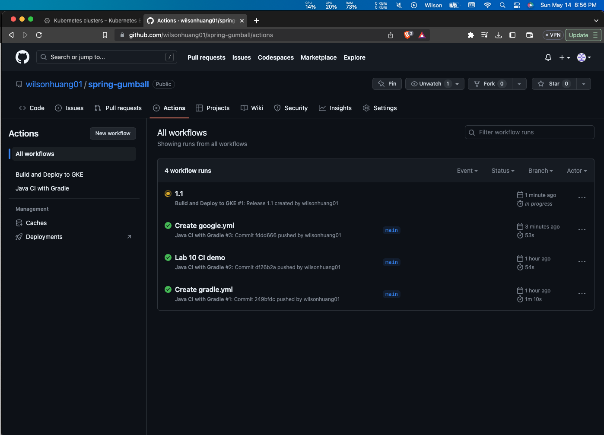
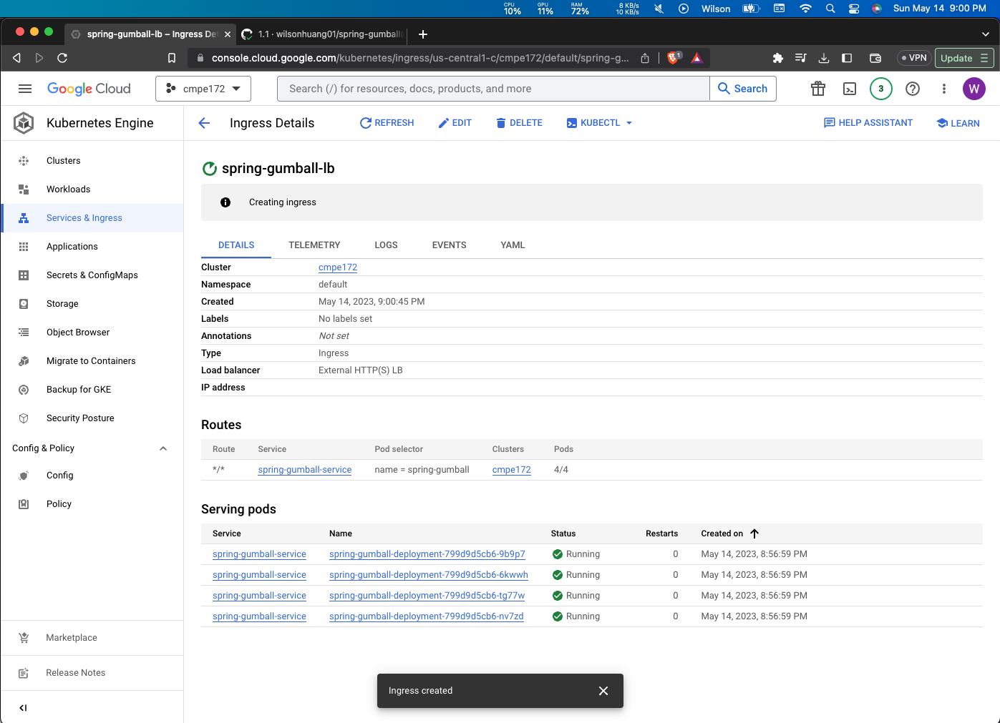

# spring-gumball ci/cd example

### This example demonstrates the following two GitHub Workflows.

* https://help.github.com/actions/language-and-framework-guides/building-and-testing-java-with-gradle

* https://github.com/google-github-actions/setup-gcloud/tree/master/example-workflows/gke

### Build Dependencies

* Gradle 5.6
* JDK 11

# Journal

## CI Workflow

Create a new "Java CI with Gradle" workflow in Actions -> New workflow and change the yml file if needed.
This creates a new CI workflow whenever there is a push or pull request.

Edit the source code then push it.

The CI workflow is executed, and it performs a series of actions as specified in the yml file.

## CD Workflow

Create a new cluster on Google Kubernetes Engine.

Enable Container Registry API and Kubernetes Engine API for the project.

Create a new Service account that has the roles "Kubernetes Engine Developer" and "Storage Admin".

Create a new Private key for the Service account and save the JSON file on the computer.

Create 2 Secrets for the GitHub repository. This enables the CD Workflow to connect to GKE.

Create a new "Build and Deploy to GKE" CD workflow in Actions -> New workflow. The yml file uses Secrets
created in the previous step to connect to GKE.

Create a new Release, which executes the CD workflow automatically.

The CD workflow is executed when a new Release on the repository is created.

The CD workflow creates a "spring-gumball-deployment" Deployment on GKE using deployment.yaml.

The CD workflow also creates a "spring-gumball-service" Service on GKE using service.yaml.

Create a new Ingress for the "spring-gumball-service" to create a public IP address and 
make it accessible from the browser.

Access the "spring-gumball" webpage using the IP address of the Ingress. Server Host/IP changes when
the user refreshes the page or interact with the page, which proves the load balancer at work.

